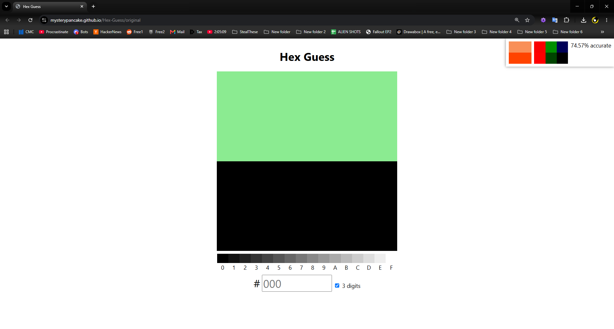
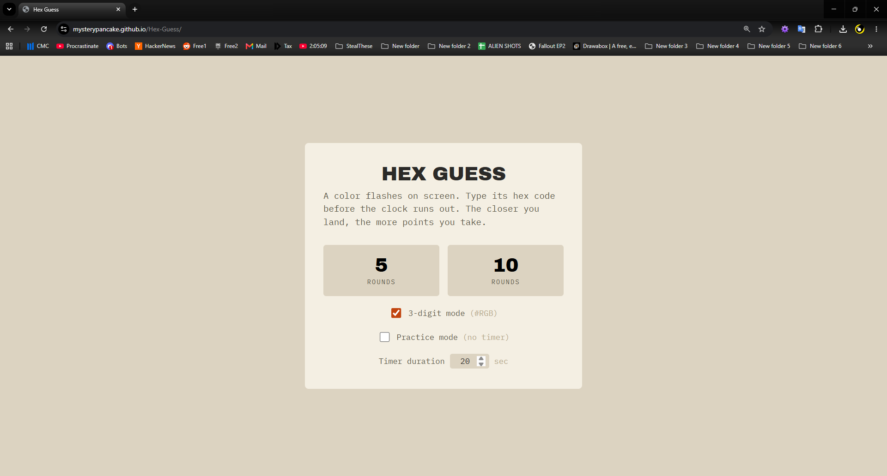
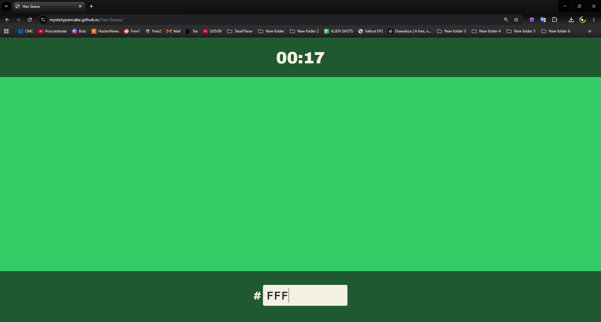
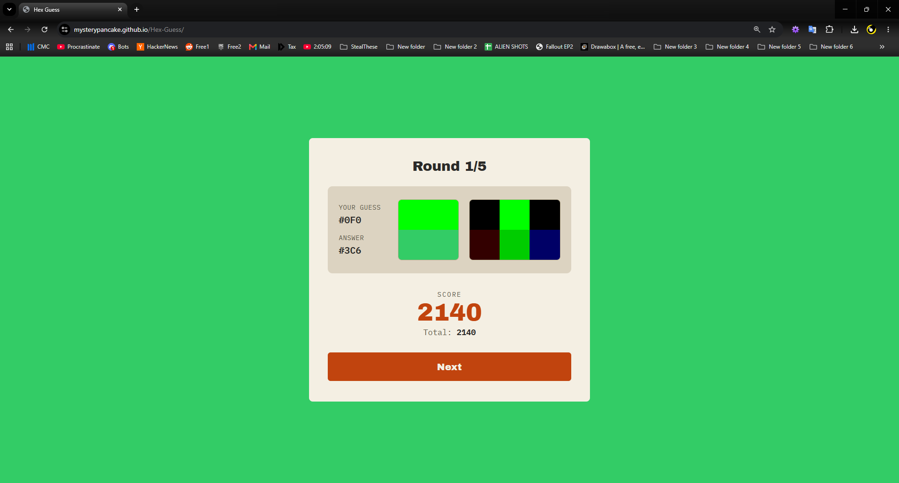
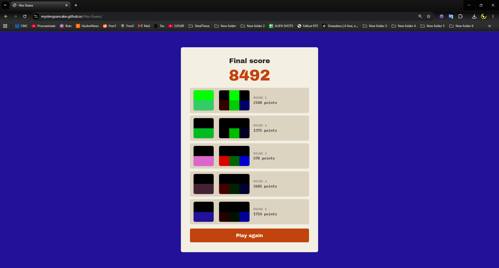
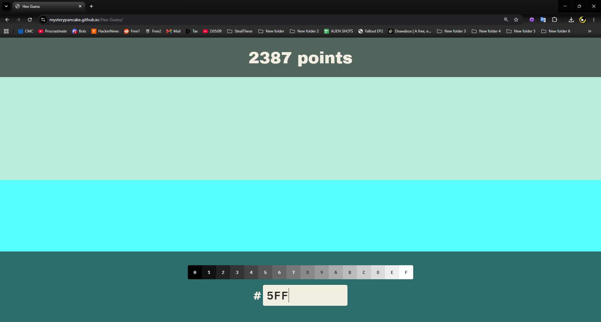

# [Hex Guess](https://mysterypancake.github.io/Hex-Guess)

Hex color guessing game. Also check out [dialed.gg](https://dialed.gg)!

## [Original Edition](https://mysterypancake.github.io/Hex-Guess/original)

Made by myself a few years ago before AI existed.

The same features are in "Practice Mode" in the AI slop edition.

## [AI Slop Edition](https://mysterypancake.github.io/Hex-Guess)

Made in 2026 thanks to the power of AI slop.

I don't endorse AI, but it's a fun way to prototype things.

  
  
  
  
  

